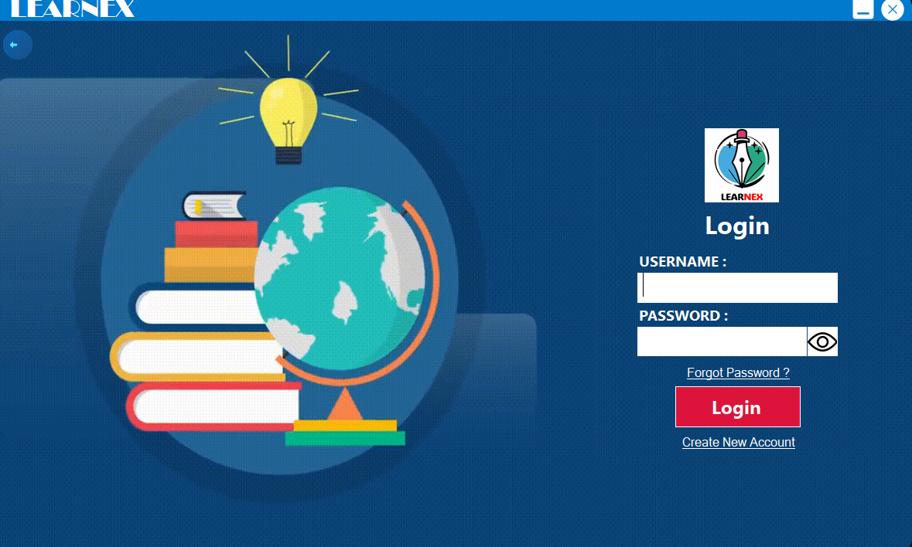
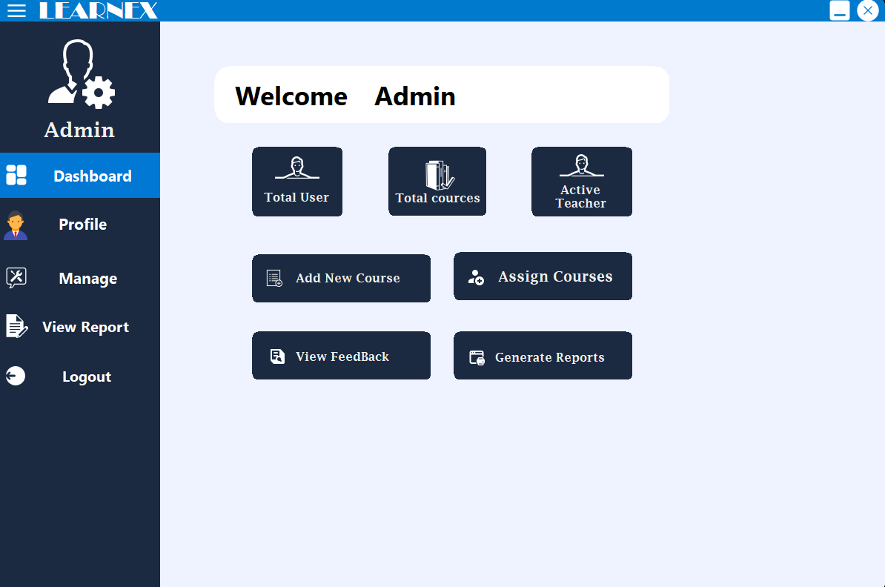
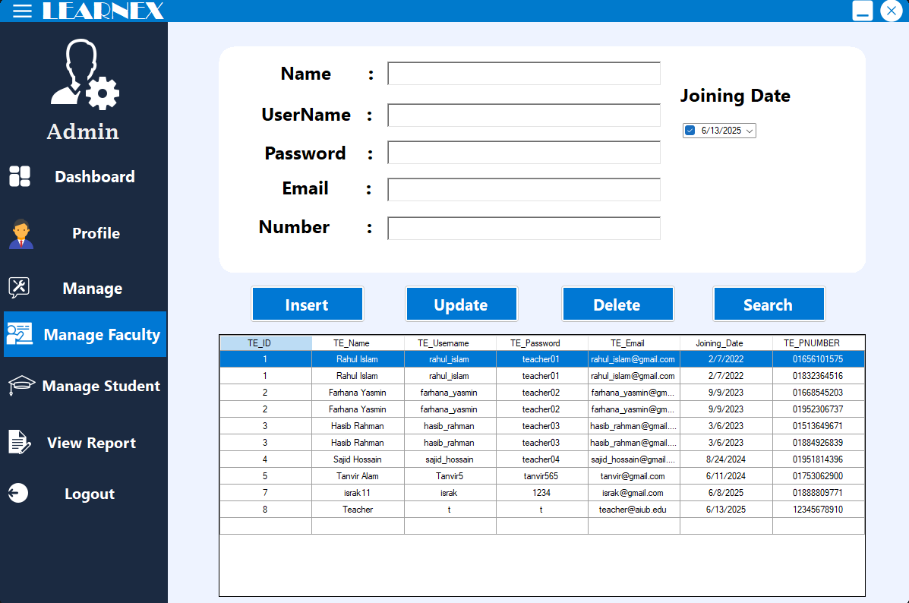
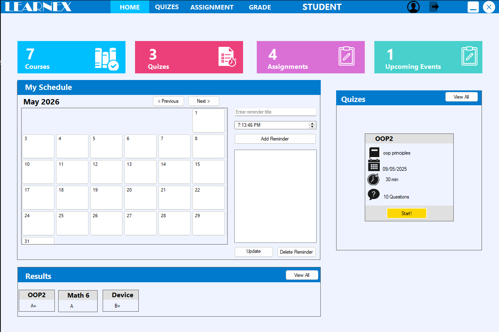

# Learnex — Learning Management System

A desktop-based Learning Management System built with **C# Windows Forms** and **SQL Server**, designed to manage academic activities for students, faculty, and administrators under one unified platform.

---

## Overview

Learnex provides role-based access for three types of users — **Admin**, **Faculty**, and **Student** — each with their own dedicated dashboard and set of features. The application is built on **.NET Framework 4.8** and uses **SQL Server Express** as the backend database.

---

## Features

### Admin Panel
- Admin Dashboard — overview of system activity
- Manage Students — add, view, and remove student records
- Manage Faculty — add, view, and remove faculty records
- Course Management — add and manage available courses
- Assign Courses — assign courses to faculty members
- Admin Profile — manage admin account details

### Faculty Panel
- Faculty Dashboard — overview of assigned courses and tasks
- Course Management — view and manage course content
- Quiz Management — create and manage quizzes for students
- Assignment Management — post and track student assignments
- Faculty Profile — manage faculty account details

### Student Panel
- Student Dashboard — view enrolled courses and upcoming tasks
- Quiz Attempt — attempt quizzes assigned by faculty
- Assignment Submission — submit and track assignments
- Grade Report — view marks and performance across courses
- Student Profile — manage personal account details

### Login & Public Panel
- Homepage — landing page of the application
- User Login — secure login for all user roles
- Sign Up — new user registration
- Forgot Password — password recovery flow
- Courses Page — browse available courses
- About & Contact Us — informational pages

---

## Screenshots

**Homepage**


**Login**


**Admin Dashboard**


**Manage Faculty**


**Student Dashboard**


---

## Tech Stack

| Layer | Technology |
|---|---|
| Language | C# (.NET Framework 4.8) |
| UI Framework | Windows Forms (WinForms) |
| Database | SQL Server Express |
| IDE | Visual Studio 2022 |

---

## Getting Started

1. Clone the repository
   ```
   git clone https://github.com/HBOSS01/Learning-Management-System-Learnex-.git
   ```
2. Open `LMS.sln` in Visual Studio 2022
3. Set up your local SQL Server database and configure the connection string
4. Build and run the solution (`F5`)

---

## Project Structure

```
LMS/
├── LogIn Panel/         # Homepage, Login, Sign Up, Forgot Password, Courses, About, Contact
├── adminPanel/          # Admin Dashboard, Manage Students/Faculty, Course & Assignment management
├── facultyPanel/        # Faculty Dashboard, Quiz, Assignment, Course, Profile
├── studentPanel/        # Student Dashboard, Quiz Attempt, Assignment, Grade Report, Profile
├── Database Connection/ # Centralized SQL Server connection helper
├── Rounded Region/      # UI helpers for rounded corners and drag support
├── Properties/          # Assembly and resource definitions
└── Program.cs           # Application entry point
```

---

## Author

**HBOSS01** — [github.com/HBOSS01](https://github.com/HBOSS01)
